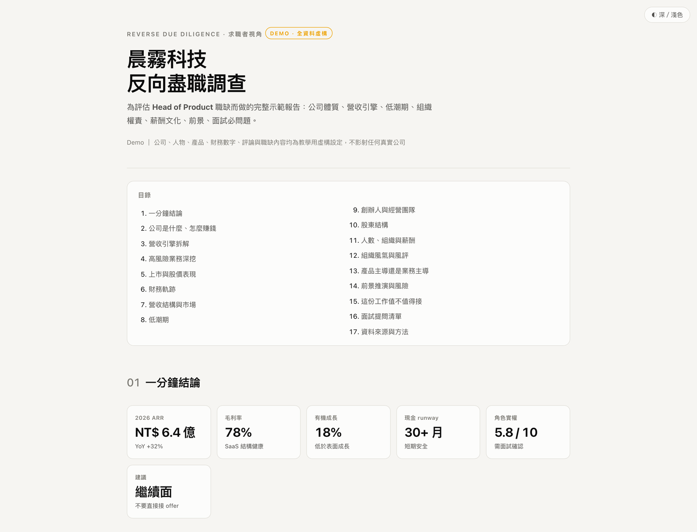

# Reverse Due Diligence Skill（RDD）

給求職者使用的 AI Agent Skill，把公司研究、職缺分析與面試驗證整合成一套可重複執行的 **反向盡職調查工作流程**。

目標是在投遞、面試、談薪或接受 offer 前，回答三個真正影響決策的問題：
1. 公司是否安全
2. 角色是否有實權
3. 哪些問題必須在面試中問到答案

## Preview

[](https://htmlpreview.github.io/?https://raw.githubusercontent.com/markleetw/reverse-due-diligence-skill/main/demo/index.html)

[查看完整互動 Demo →](https://htmlpreview.github.io/?https://raw.githubusercontent.com/markleetw/reverse-due-diligence-skill/main/demo/index.html)

> Demo 中的公司、人物、產品、財務數字、評論與職缺內容均為虛構，只用來展示分析方法與報告形式。

<!-- release-notes:start -->
## 安裝

到 [Releases](https://github.com/markleetw/reverse-due-diligence-skill/releases) 下載最新的 `reverse-due-diligence.zip`。

| AI Tool | 說明 |
| --- | --- |
| ChatGPT | 把 ZIP 丟進 ChatGPT 對話，請它安裝這個 Skill。 |
| Claude | 設定 → Skills → 新增 → 上傳 Skill |


## 使用

至少提供 **公司 + 職缺／角色**；如果已經有其他資訊或明確決策，也一起附上。

```text
/rdd 台積電 資深工程師
/rdd 某某公司 Head of Product，幫我判斷值不值得接
/rdd 某某公司 Senior PM，我正在準備二面，面試官可能是 Jeff Dao，幫我整理最重要的 P0 問題
```

如果有 JD、offer、獵頭訊息、面試筆記或內部人士說法，也可以一起提供。這些資料會與公開資訊分開標示證據層級，不會直接當成已證實事實。
<!-- release-notes:end -->

---

# 研究範圍

RDD 不僅判斷「這家公司好不好」，還會把 **公司風險** 與 **角色風險** 分開處理。

| 面向 | 主要回答的問題 |
| --- | --- |
| 公司體質 | 財務是否穩定？成長來自本業、併購還是擴編？現金流與獲利品質如何？ |
| 商業模式 | 誰付錢、付多少、換到什麼？各營收線的成長、毛利與結構性風險是什麼？ |
| 低潮與復原 | 過去出過什麼問題？公司修的是短期症狀，還是決策機制？ |
| 治理與組織 | 創辦人、經營團隊、股東結構與組織變化，會如何影響這個角色？ |
| 職缺實權 | KPI、roadmap、Pricing、budget、headcount 與跨部門決策權是否對稱？ |
| 薪酬與文化 | 官方揭露、公開職缺、匿名評論與其他訊號是否彼此一致？ |
| 求職決策 | 值不值得投、值得不值得接、哪些條件需要談、哪些答案可能是警訊？ |

# 分析方法

這個 Skill 不是追求收集更多資料，核心是在提高**證據品質與判斷品質**。

- **原始資料優先**：上市櫃公司優先使用財報、法說、公開資訊與公司正式揭露；媒體、匿名評論與口述資訊分開標示證據強度。
- **重新驗算重要數字**：營收占比、成長率、費率、人均營收等承重數字，盡量回到原始分母重新計算，不直接沿用二手文章的結論。
- **區分「事實」與「推論」**：公司已揭露的事實、第三方訊號與本報告的推論分開處理；公開資料查不到的項目不補值、不猜答案。
- **拆解成長品質**：區分有機成長與併購、規模成長與人力堆疊、名目數字與實質經濟效果。
- **從低潮反推決策能力**：不只看公司現在是否成長，而是分析過去犯過什麼錯、怎麼修，以及同類問題是否可能再發生。
- **把研究轉成可驗證問題**：公開資料無法回答的權責、KPI、資源與組織問題，轉成 P0／P1／P2 面試題，並標示應該問誰與什麼答案是警訊。

# 交付內容

預設產出一份自包含的 HTML 報告。章節會依公司與職缺調整，完整研究通常涵蓋：

- 一分鐘結論與關鍵指標
- 公司與商業模式、營收引擎
- 高風險業務或監管議題
- 股價、股權與財務軌跡
- 營收結構、區域市場與成長品質
- 歷次低潮與復原路徑
- 創辦人、經營團隊與股東結構
- 員工規模、組織、薪酬與文化訊號
- Product-led / Sales-led 結構判斷
- 前景、主要風險與情境推演
- 「這份工作值不值得接」的明確立場
- 分級面試提問清單與現場 P0 速查
- 資料來源、方法與不確定性說明

完整章節設計可直接看 [Live Demo](https://htmlpreview.github.io/?https://raw.githubusercontent.com/markleetw/reverse-due-diligence-skill/main/demo/index.html)。

# 適用情境

可以在不同決策階段使用同一套流程：

- **投履歷前**：先判斷公司與職缺是否值得投入時間。
- **面試進行中**：補足公開資料無法回答的權責、KPI、資源與組織問題。
- **收到 offer 後**：把公司風險、角色品質、薪酬與股權條件放在同一個決策框架裡比較。
- **高階或跨職能角色**：特別適合 Product、Engineering、Design、Marketing、Business 等權責容易跨部門的職缺。

上市公司通常能取得較完整的法定揭露；未上市公司也能執行，但會更依賴募資資訊、公開職缺、產品痕跡、組織訊號與使用者提供的 JD／offer／獵頭資訊。

# 研究邊界

RDD 是求職決策工具，不是投資研究、法律意見或背景徵信服務。

研究會盡量回到可驗證來源，但公開資料本身有邊界，尤其是未上市公司、內部組織與實際決策權。遇到無法確認的資訊，報告應明確標示「未取得／待查」或保留為面試驗證題，而不是為了讓結論完整而補一個合理猜測。

匿名評論與單一口述只作為訊號；真正會改變結論的承重主張，應盡量由原始資料、交叉來源或面試中的具體案例支撐。

---

開發與維護資訊請看 [Development](docs/development.md)。
